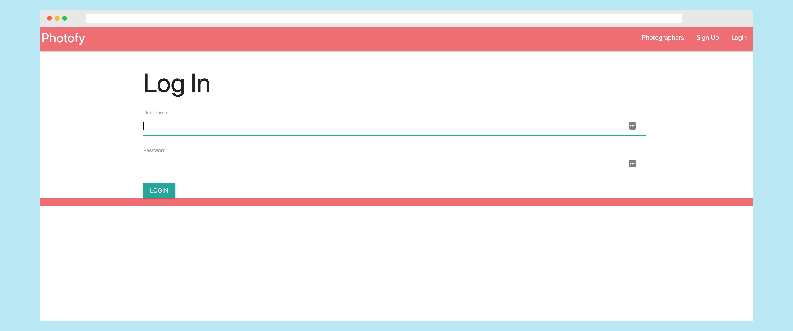

# Photofy - Discover Photographers

## Table of contents
* [General Info](#general-info)
* [Technologies Used](#technologies-used)
* [Getting Started](#getting-started)
* [Next Steps](#next-steps)

## General info
An application to help customers book photography sessions with photographers.
	
## Technologies Used
Project is created with:
* Python
* Django
* PostgreSQL
* Amazon Web Services S3
* Heroku

## Getting Started

* [Visit Heroku Site](https://www.google.com)
* [Trello Board](https://www.trello.com)
* [Pitch Deck](https://www.google.com)

## Next Steps
* About section for photographer

