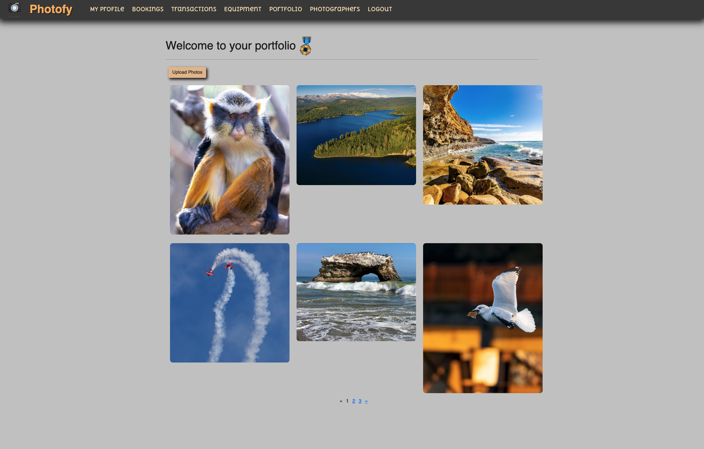
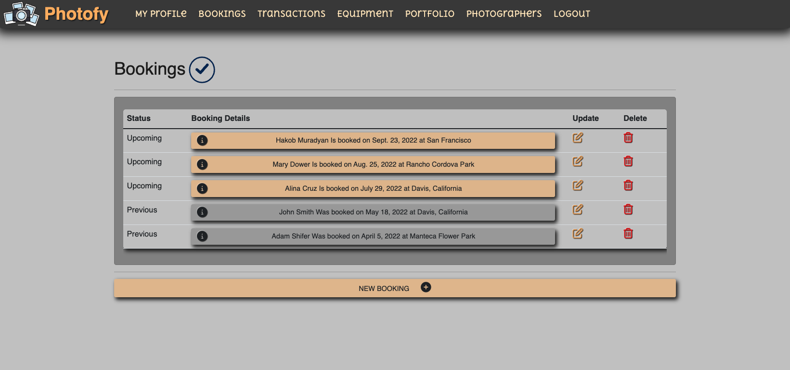
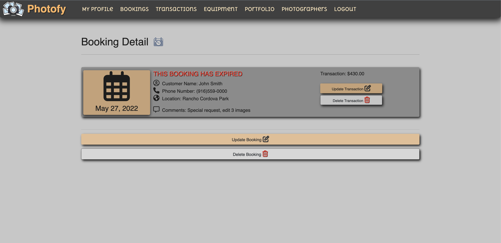
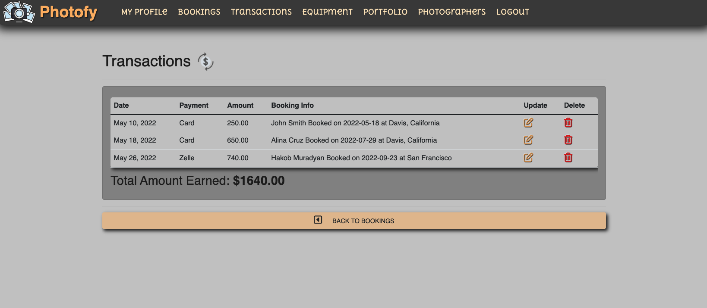
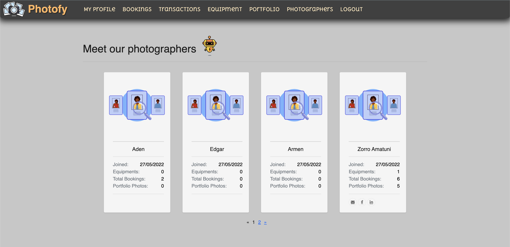

[![Contributors][contributors-shield]][contributors-url]
[![Forks][forks-shield]][forks-url]
[![Stargazers][stars-shield]][stars-url]
[![Issues][issues-shield]][issues-url]
[![MIT License][license-shield]][license-url]

<!-- PROJECT LOGO -->
 

  

  <h1 align="center">Photofy </h1>

  

    <h3>An application for photographers and customers.</h3>
     
    <h1><a href="https://photofyproject.herokuapp.com/">Live App »</a></h1>
     
     
    <a href="https://github.com/users/lcrosariol/projects/2">Github Project Board</a>
    ·
    <a href="https://docs.google.com/presentation/d/1DKjHvccZqNiwuYVTtwiqE3vCKofOQT7Wz5ZywFELVrc/edit?usp=sharing">Pitch Deck</a>
  

    
   
 <strong>Portfolio Page</strong> 

     

   
 <strong>All Bookings Page</strong> 

    

   
<strong> Booking Page </strong> 

    

 

   
 <strong>Transactions Page</strong> 

    

 

   
 <strong>Photographers Page</strong> 

    

 

## Technologies Used
Project is created with:
* Python
* Django
* Crispy Forms
* Django Paginator
* PostgreSQL
* Amazon Web Services S3 Bucket
* Heroku

## Next Steps
- [ ] About section for photographer
- [ ] Integrate Stripe to accept payments
- [ ] Connect bookings to Google/Apple calendar

(<a href="#top">back to top</a>)

<!-- MARKDOWN LINKS & IMAGES -->
<!-- https://www.markdownguide.org/basic-syntax/#reference-style-links -->
[contributors-shield]: https://img.shields.io/github/contributors/lcrosariol/Photofy.svg?style=for-the-badge
[contributors-url]: https://github.com/lcrosariol/Photofy/graphs/contributors
[forks-shield]: https://img.shields.io/github/forks/lcrosariol/Photofy.svg?style=for-the-badge
[forks-url]: https://github.com/lcrosariol/Photofy/network/members
[stars-shield]: https://img.shields.io/github/stars/lcrosariol/Photofy.svg?style=for-the-badge
[stars-url]: https://github.com/lcrosariol/Photofy/stargazers
[issues-shield]: https://img.shields.io/github/issues/lcrosariol/Photofy.svg?style=for-the-badge
[issues-url]: https://github.com/lcrosariol/Photofy/issues
[license-shield]: https://img.shields.io/github/license/lcrosariol/Photofy.svg?style=for-the-badge
[license-url]: https://github.com/lcrosariol/Photofy/blob/master/LICENSE.txt

[product-screenshot]: images/screenshot.png
