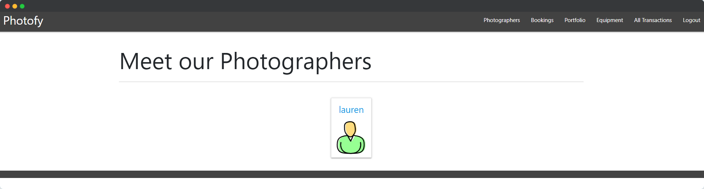
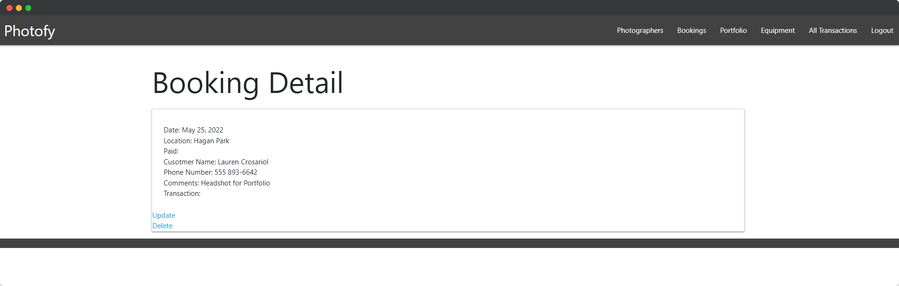
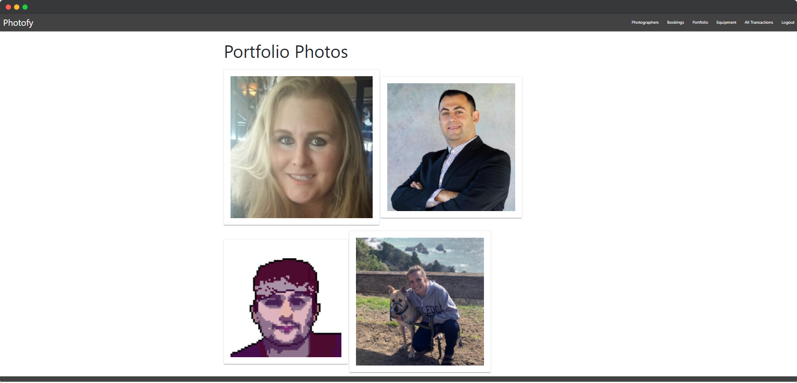

[![Contributors][contributors-shield]][contributors-url]
[![Forks][forks-shield]][forks-url]
[![Stargazers][stars-shield]][stars-url]
[![Issues][issues-shield]][issues-url]
[![MIT License][license-shield]][license-url]
[![LinkedIn][linkedin-shield]][linkedin-url]
<!-- PROJECT LOGO -->
 

  

  <h3 align="center">Photofy </h3>

  

    An application for photographers and customers.
     
    <a href="https://github.com/othneildrew/Best-README-Template"><strong>View site »</strong></a>
     
     
    <!-- <a href="https://github.com/othneildrew/Best-README-Template">View Site</a>
    · -->
    <a href="https://github.com/users/lcrosariol/projects/2">Github Project Board</a>
    ·
    <a href="https://github.com/othneildrew/Best-README-Template/issues">Pitch Deck</a>
  

 

## Technologies Used
Project is created with:
* Python
* Django
* PostgreSQL
* Amazon Web Services S3
* Heroku

## Next Steps
* About section for photographer
* Integrate Stripe to accept payments
* Connect bookings to Google/Apple calendar

(<a href="#top">back to top</a>)

<!-- MARKDOWN LINKS & IMAGES -->
https://github.com/lcrosariol/Photofy
<!-- https://www.markdownguide.org/basic-syntax/#reference-style-links -->
[contributors-shield]: https://img.shields.io/github/contributors/lcrosariol/Photofy.svg?style=for-the-badge
[contributors-url]: https://github.com/lcrosariol/Photofy/graphs/contributors
[forks-shield]: https://img.shields.io/github/forks/lcrosariol/Photofy.svg?style=for-the-badge
[forks-url]: https://github.com/lcrosariol/Photofy/network/members
[stars-shield]: https://img.shields.io/github/stars/othneildrew/Best-README-Template.svg?style=for-the-badge
[stars-url]: https://github.com/othneildrew/Best-README-Template/stargazers
[issues-shield]: https://img.shields.io/github/issues/othneildrew/Best-README-Template.svg?style=for-the-badge
[issues-url]: https://github.com/othneildrew/Best-README-Template/issues
[license-shield]: https://img.shields.io/github/license/othneildrew/Best-README-Template.svg?style=for-the-badge
[license-url]: https://github.com/othneildrew/Best-README-Template/blob/master/LICENSE.txt
[linkedin-shield]: https://img.shields.io/badge/-LinkedIn-black.svg?style=for-the-badge&logo=linkedin&colorB=555
[linkedin-url]: https://linkedin.com/in/johnmccants
[product-screenshot]: images/screenshot.png